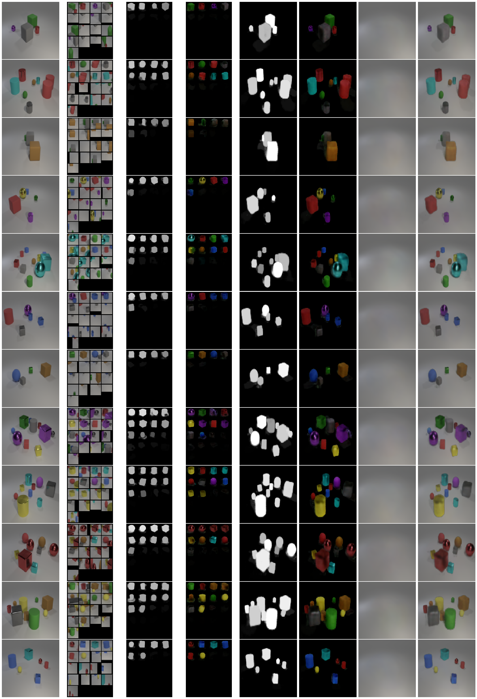

# SPACE Pytorch
Note: If you don't see any progress (commits) don't despair, I'm still working on this (10/04/20)

This is an attempt to replicate SPACE: Unsupervised Object-Oriented Scene Representation via Spatial Attention and Decomposition https://arxiv.org/abs/2001.02407 on Pytorch. Most of the code is a clone from https://github.com/NVlabs/SSV.

A model that combines the Self-Supervised Viewpoint Learning from Image Collections (SSV) (http://arxiv.org/abs/2004.01793) encoder and the SPACE decoder is currently working on the CLEVR dataset with a very simple train look with few constraints.

For training and results please see the space-only notebook.

